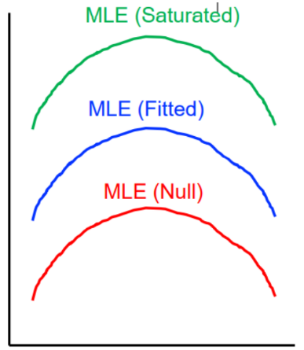

```{css echo=FALSE}
<style type="text/css">
body, td {
   font-size: 20px;
}
code.r{
  font-size: 19px;
}
pre {
  font-size: 70px
}
</style>
```


```{r setup, include=FALSE}
options(htmltools.dir.version=FALSE)
knitr::opts_chunk$set(tidy=FALSE, echo=TRUE, cache=FALSE)
```


```{R xaringan-tile-view, echo=FALSE}
xaringanExtra::use_tile_view()
```

```{r xaringan-editable, echo=FALSE}
xaringanExtra::use_editable(expires = 1)
```

```{r xaringan-scribble, echo=FALSE}
xaringanExtra::use_scribble()
```


```{r xaringan-panelset, echo=FALSE}
xaringanExtra::use_panelset()
```

```{r xaringan-fit-screen, echo=FALSE}    
xaringanExtra::use_fit_screen()  
```  

---
class: center, middle
# Overcomplicated models 
# Oversimplified models
???
Since kyle's course content is too much, so I just focus on one question to start my presentation ,In this process I will also talk generally about what is Generalized linear model and linear mixed model but there would not be too much details because of the litmiithed time. Anyway, the question is about when we try to Analysis our data, even we have built  a model to explain the relationship between the response variables and independent variables, how could we know this model is good or not? Based this question, I rebuilt two kinds of situation, one is Overcomplicated models, another is  Oversimplified models, in the fist case ,i would use the Generalized linear model as the example , in the second case i would use the linear mixed model as the example.
---
class: center, middle
# Overcomplicated models
---
## example 1 
```{r example1, echo=FALSE}
library(DT)
data<- read.table(file="E:/academic_resources/note-tutorial/data/binary.csv",header=T, row.names=NULL)
datatable(data)
```
???
here is the example 1, the response variable is about Admission Qualifications, 1 means you got that ,0 means you faild, and here are 3 independent variables, gre is the grades of one kind of tests, and gpa is the average of all grades about the courses in your  graduate school. rank is the  the ranking of the school you are applying to. obviously, the response variable does not fit the normal distribution, and it is binomial data!! so we need to use the glm!!
---
## Maximum Likelihood Estimation
- MLE is the most likely value of the parameters given the data.
- Deviance is difference between 
likelihoods and the saturated Lik
.pull-left[

]

.pull-right[

]

???
- 左 before showing the code , I have to introduce what is Maximum Likelihood Estimation generally. Briefly MLE is the most likely value of the parameters given the data which means that we rebuit another function and put all the data and parameters in this new function, then we just need to find the turing point of this function, just like  seeking  the derivative.
- 右 In addition to finding the parameters of glm, by this way, we also use this method to evaluate the  fitted model, first we need to build the Null model which means minimal information explained and the formula looks like y ~ 1 (no predictors); then  the Saturated model which means maximal information explained y~ b1x1 + b2x2 + x3 +….+ xn(one parameter for each data );  lastyly, the Fitted model is  our prediction model,the fomular looks like:y ~ b1x1 + b2x2, we use this way to evaluate, I would explain more in the code

---
.panelset[
.panel[.panel-name[Code-built]
```{r example2, eval=FALSE}
mydata <- read.csv("E:/academic_resources/note-tutorial/data/binary.csv",header=T,sep=" ")
mydata$rank <- as.factor(mydata$rank)
#全模型
dim(mydata)
mydata$x1 <- as.factor(1:nrow(mydata))
glmS <- glm(admit ~ x1, data = mydata, family = "binomial")
#零模型
glm0 <- glm(admit ~ 1, data = mydata, family = "binomial")
#被测试模型1
glm1 <- glm(admit ~ gre+gpa+rank, data = mydata, family = "binomial")
#被测试模型2
glm2 <- glm(admit ~ gpa+rank, data = mydata, family = "binomial")
```
]

.panel[.panel-name[Code-compare]
```{r example3, eval=FALSE}
#Q1:glmS and glm0 ?
summary(glmS)$deviance
summary(glm0)$deviance
summary(glm1)$deviance
2*(logLik(glmS)-logLik(glm0))
2*(logLik(glmS)-logLik(glm1))
summary(glm1)

#Q2:glm1 and glm2 ?
summary(glm1)$deviance
summary(glm2)$deviance
anova(glm1,glm2,test='Chisq')

#Q3:another way-AIC
library(MuMIn)
options(na.action = "na.fail") 
dredge(glm1)
print(AICglm1 <- -2*(logLik(glm1))+ 2*6)
print(AICglm2 <- -2*(logLik(glm2))+ 2*5)
```
]

.panel[.panel-name[Q1]
.left-column[
```{r example4, echo=FALSE, message=FALSE, warning=FALSE}
mydata <- read.csv("E:/academic_resources/note-tutorial/data/binary.csv",header=T,sep=" ")
mydata$rank <- as.factor(mydata$rank)
#saturated model
mydata$x1 <- as.factor(1:nrow(mydata))
glmS <- glm(admit ~ x1, data = mydata, family = "binomial")
#null model
glm0 <- glm(admit ~ 1, data = mydata, family = "binomial")
#fitted model 1
glm1 <- glm(admit ~ gre+gpa+rank, data = mydata, family = "binomial")
#fitted model 2
glm2 <- glm(admit ~ gpa+rank, data = mydata, family = "binomial")
summary(glmS)$deviance
summary(glm0)$deviance
summary(glm1)$deviance
2*(logLik(glmS)-logLik(glm0))
2*(logLik(glmS)-logLik(glm1))

```
]

.right-column[


]
]

.panel[.panel-name[Q2]
```{r example5, echo=FALSE, message=FALSE, warning=FALSE}
mydata <- read.csv("E:/academic_resources/note-tutorial/data/binary.csv",header=T,sep=" ")
mydata$rank <- as.factor(mydata$rank)
mydata$x1 <- as.factor(1:nrow(mydata))
glmS <- glm(admit ~ x1, data = mydata, family = "binomial")
#零模型
glm0 <- glm(admit ~ 1, data = mydata, family = "binomial")
#被测试模型1
glm1 <- glm(admit ~ gre+gpa+rank, data = mydata, family = "binomial")
#被测试模型2
glm2 <- glm(admit ~ gpa+rank, data = mydata, family = "binomial")
summary(glm1)$deviance
summary(glm2)$deviance
anova(glm1,glm2,test='Chisq')
```
]


.panel[.panel-name[Q3]

```{r example6, echo=FALSE, message=FALSE, warning=FALSE}
print(AICglm1 <- -2*(logLik(glm1))+ 2*6)
print(AICglm2 <- -2*(logLik(glm2))+ 2*5)
library(MuMIn)
options(na.action = "na.fail") 
dredge(glm1)
```
]
]

???
- 1. first, we put our data into the matrix called mydata,  and because the rank is Categorical variable, so we set it as the factor. then,in order to buid the satured model we create a new vector we called x1 , and x1 is made of the number from 1 to 400 because there are 400 rows in the raw data, but i am not sure why buiding  the saturated model in this way, maybe  due to the assumption that consecutive natural numbers are perfectly normally distributed. second we build the null model, as you can see there is no predictor, and we build two fitted model, one includes three predictors anthoer includes 2 predictors , there is no reason why i remove the gre, doing this just for comparison and Explanation.
-2. Q1: 
    - as we said before, the deviance is the difference between the likelihood of model we intersted and the likelihhod of saturated, 
    - so the result of summary(glmS)$deviance should touch 0, because there is no differnce between the saturated model. 
    - and the result of summary(glm0)$deviance (499)should be the maximal because do you remeber the picture, the distance between the null model and the saturated model is the largest. we could see it from the result of summary function of any other fitted model(here!!!) 
    - and the result of summary(glm1)$deviance(458) is the difference between saturated model and glm1 model, we could see it in the summary result(here!!!!)
2. so the following two fomular just for showing how to caculte the deviance , their results should be the same as these two lines of code.lets see the result. 
-2. Q1:generally,  among the several fitted models,The smaller the residuals, the better the model!!! becase  when the deviance is smaller,it means our fitted model is closer to the saturated model, and the unexplained part of the response variation is less. so now we could see Q2
- C-c!!!!Q2：we use the code  like this to get these two fitted model to get their devicane , and see the result(Q2)!!!!! the first one is smaller, could we say  that the glm1 is better????? No!!!because we need to test the diffence bwteween these two model's deviance is significant or not !!! C-c!!!we use anova function, and specify the chi-squared distribution to test, Q2!!see the result ,it significant, so the first one is better!!!
- C-C!!!!should i write all fitted model like this way ？C-c？？no！we could use the function called dredge from the MUMIN package and we would get all subset models and AIC,AIC is an Indicator to help us to know which model is the best, and these two lines show how to calculate AIC, as you can see the likelihood also used here ,so the we should choose the smaller AIC, let's see the result Q3!!! 
- Q3!! the first row is the glm1， every preditors are included,the secon row is glm2, just remove the gre.
 


---
class: center, middle
# Oversimplified models
???
 let's see situation 2 
---
## example 2
```{r echo=FALSE}
library(DT)
data<- read.table(file="E:/academic_resources/note-tutorial/data/Radon_Data_RB.csv",header=T,row.names=NULL,sep=",")
datatable(data)
```

???
see the example 2 , the response variable is radon which means one kind of  harmful substance's concentration. the independent variable is county and floor. as you could see there are  68 county, and the floor of 0 row  means the concentration of radon on the ground , 1 means the concentration of radon on the first floor. don't care about the cgroup, it would not be used in this example. our question is about : is the concentration of radon  different  from the ground and the first floor????
---
class: center, middle
# modeol 1
## linear model
???
first we try to buid the simplest model

---
.panelset[
.panel[.panel-name[Code-lm]


```{r eval=FALSE}
radon <- read.csv('E:/academic_resources/note-tutorial/data/Radon_Data_RB.csv', h=TRUE)
radon$floor <- as.factor(radon$floor)
radon$county <- as.factor(radon$county)
radon$cgroup <- as.factor(radon$cgroup)

mod.radon.lm1 <- lm(radon~floor, data=radon)

summary(mod.radon.lm1) 
```
]

.panel[.panel-name[Result-lm]
```{r echo=FALSE}
radon <- read.csv('E:/academic_resources/note-tutorial/data/Radon_Data_RB.csv', h=TRUE)
radon$floor <- as.factor(radon$floor)
radon$county <- as.factor(radon$county)
radon$cgroup <- as.factor(radon$cgroup)
mod.radon.lm1 <- lm(radon~floor, data=radon)
summary(mod.radon.lm1)
```
]
]
???
- C-l: put all the data to the matrix called radon,set the Categorical Variable as factor, Write the fomular for the linear model, y is radon, x is floor, and the data we use from the matrix of radon, use the function summary to answer our question.
- R-l: the p value told us :yes!! about the concentration of radon, there a huge diffence between the ground and first floor!! so do you think these results are correct???????? NO!!!note the value of R-squared, only 0.03!!!! this means the linear relationship between y and x explains only 0.03 of the total variation in y！！in another words， the model we build almost can not  explain the data we have !! such kind of problem of would appear just because our model too simple and at the same time, the number of our samples are too much, see back sheet！！！we have more than two thousands samples, when model is simple ,but the number of sample is large, we get very samll standard error, and then we get  very small p value, so no matter what is the real relationship between x and y, when we have a lot of samples ,the p value is always significant, but the model is Inappropriate!!!!so how could we deal with the problem??

---
class: center, middle
# <font color=red>add the  independent variable !!! </font>
???
just add more independent variable!
---
class: center, middle
# modeol 2
## linera mixed model
???
and let's build another model
---
.panelset[
.panel[.panel-name[Code-plot]
```{r eval=FALSE}
library(ggplot2)
#right image
ggplot(data=radon, aes(x=floor, y=radon)) + geom_point() + geom_smooth(method='lm')
#left image
ggplot(data=radon, aes(x=floor, y=radon, group=county)) +
  geom_point() +
  geom_smooth(method='lm') +
  facet_wrap(~county) 
#Random effect and fixed effect????
```
]

.panel[.panel-name[plot]

.pull-left[
```{r echo=FALSE, message=FALSE, warning=FALSE}
radon <- read.csv('E:/academic_resources/note-tutorial/data/Radon_Data_RB.csv', h=TRUE)
radon$floor <- as.factor(radon$floor)
radon$county <- as.factor(radon$county)
radon$cgroup <- as.factor(radon$cgroup)
library(ggplot2)
ggplot(data=radon, aes(x=floor, y=radon, group=county)) +
  geom_point() +
  geom_smooth(method='lm') +
  facet_wrap(~county) 
```
]


.pull-right[
```{r echo=FALSE, message=FALSE, warning=FALSE}
radon <- read.csv('E:/academic_resources/note-tutorial/data/Radon_Data_RB.csv', h=TRUE)
radon$floor <- as.factor(radon$floor)
radon$county <- as.factor(radon$county)
radon$cgroup <- as.factor(radon$cgroup)
library(ggplot2)
par(mfrow=c(1,1))
ggplot(data=radon, aes(x=floor, y=radon, group=1)) + geom_point() + geom_smooth(method='lm')
```
]
]

.panel[.panel-name[Code-lmer1]
```{r eval=FALSE}
library(lme4)
mod.radon.lmer1 <- lmer(radon~floor + (1|county), data=radon)
summary(mod.radon.lmer1) 
```
]

.panel[.panel-name[Result-lmer1]
```{r echo=FALSE, message=FALSE, warning=FALSE}
library(lme4)
mod.radon.lmer1 <- lmer(radon~floor + (1|county), data=radon)
summary(mod.radon.lmer1) 
```
]

.panel[.panel-name[Code-lmer2]
```{r eval=FALSE}
library(lme4)
mod.radon.lmer2 <- lmer(radon ~ floor + (1+floor|county), data=radon)
summary(mod.radon.lmer2) 
```
]

.panel[.panel-name[Result-lmer2]
```{r echo=FALSE, message=FALSE, warning=FALSE}
library(lme4)
mod.radon.lmer2 <- lmer(radon ~ floor + (1+floor|county), data=radon)
summary(mod.radon.lmer2) 
```
]
.panel[.panel-name[Compare-value]
.pull-left[
```{r}
rbind(fixef(mod.radon.lmer1),fixef(mod.radon.lmer2))
```
]
.pull-right[
```{r}
VarCorr(mod.radon.lmer1) 
VarCorr(mod.radon.lmer2)
```
]
]

.panel[.panel-name[Compare-plot]
```{r echo=FALSE, message=FALSE, warning=FALSE}
preddat <- expand.grid(floor=c('0', '1'),county =1:68)
preddat$county <-as.factor(preddat$county)

library(lme4)
mod.radon.lmer1 <- lmer(radon~floor + (1|county), data=radon)
mod.radon.lmer2 <- lmer(radon ~ floor + (1+floor|county), data=radon)

preddat$pred.fix1 <- predict(mod.radon.lmer1, newdata=preddat, re.form=~0)
preddat$pred.sh1 <- predict(mod.radon.lmer1, newdata=preddat, re.form=NULL) 
preddat$pred.fix2 <- predict(mod.radon.lmer2, newdata=preddat, re.form=~0)
preddat$pred.sh2 <- predict(mod.radon.lmer2, newdata=preddat, re.form=NULL) 


library(ggpubr)
library(ggplot2)
p1=ggplot(data=preddat, aes(x=floor, y=pred.fix1, group=1)) + geom_point() + geom_smooth(method='lm')
p2=ggplot(data=preddat, aes(x=floor, y=pred.fix2, group=1)) + geom_point() + geom_smooth(method='lm')
p3=ggplot(data=preddat, aes(x=floor, y=pred.sh1, group=county)) + geom_point() + geom_smooth(method='lm')
p4=ggplot(data=preddat, aes(x=floor, y=pred.sh2, group=county)) + geom_point() + geom_smooth(method='lm')
p5=ggplot(data=preddat, aes(x=floor, y=pred.sh1, group=1)) + geom_point() + geom_smooth(method='lm')
p6=ggplot(data=preddat, aes(x=floor, y=pred.sh2, group=1)) + geom_point() + geom_smooth(method='lm')

ggarrange(p1, p3, p5, p2, p4, p6, ncol = 3, nrow = 2) 
```

]
]
???
- C-p！！！before we buid the linear mixed model, we plot first . we draw the right image, the black points is the raw data of radon and floor, and we would use the lm method to draw the line in oder to  show  the relationship of radon bwtween the ground and floor 1, PLOT!!! 
- PLOT!!!as we could see, in the linear model , the concentration of radon on the groud is higher!!!! but we should know these more than two thousands date from more than 60 county!!and we have already known the lm model is not appropriate. so when we plot the image according to the different county, we would find in some county ,the concentration of radon on first floor is higher! but in some county ,there is no difference, and even in some county a lot of data is missing. so we could see clearly the variable of county has a great influence on the the relationship about radon bwtween the ground and floor 1!!! 
- C-p!!!! so from this example we could see , when the variable is Directly related to our question or hypothesis, and there are enough information in it and it is experimental manipulations, we choose it as fixed factor, just like the variable "floor" in these example. and if the variable  is not our main concern and maybe we don't have enough information about it but it still have some inluence on the variation of response variable, this would help us to increase  our test power,then we set it as radom factor, just like the variable of county in our example!!! when we think about these two types of effect, the model we build would be called linear mixd model!!
- C-l1!!!there are also two types of radom effct in the mixed model, let's see the first one,in R we set the radom effect like this,and the floor is the fixed factor. In front of the vertical line, there is only the number of 1 which means there are the same slope of leverls inside the factor of ramdom , this  is called random intercept models .
- C-l2!!!!, but in this model In front of the vertical line, there are number of 1 and the fixed factor  which means there are differnt  slope of leverls inside the factor of ramdom.  and this is called  random slope models!!i would draw a picture to show their differnce,-------so in conclusion, in the radom intercept models, among the differnt county , the concentration of radon on the ground is diffent, but the differances between  the ground and floor 1 are the same , but in this random slope models, among the differnt county , the concentration of radon on the ground is diffent as well as differances between  the ground and floor 1 are differnt!!!!
- Result!!!!!!: when we summary these two types of mixed moedls ,we could the result there are 2 parts ,one part  is about radom effect  and it told us about the  components of variance, why the infomation is so limiited because when we estimate the radom factor's parameter, we assume it is consistent with a normal distribution and its mean value is 0!!! another part is about fixed effect , it only shows the estimate and t value, there is no p value?? why?? i would explain later.
- Compare,let's compare these two models' resutls, (left!!)as you can see the intercpet reprecent floor0, and because of the diffent types of radom models, so their estimates are a little bit differnt, this is the part of  fixed effect , as for the part of  radom  effect, (right!!!)see here, we could see  when we use the radom slope models, the std deviance of residual is smaller!!!that means in the unexplained part of the total variation of response variable becomes less!!but the question is no matter in this part or in the fixed effect part we don' t have enough imformation to decide should I remove some independent variable? or the model i build is good enough??
---
class: center, middle
# <font color=red>How to evaluate lmm ??? </font>

???
in order to answer these questions, i would give the third example, because the in the former one, all of the independent variables are factors, that is not easy to understand.
---
## example 3
```{r echo=FALSE}
library(DT)
data<- read.table(file="E:/academic_resources/note-tutorial/data/plantdamage3.csv",header=T,row.names=NULL,sep=",")
datatable(data)
```
???
here is the example 3 ,
the response variable is the growth of seedings , and the fixed effect are light and damage, the radom effect is shadehouse. now we have 10   shadehouse , in 5 shedehouse we create the enviroment with light, and this L, in ohter 5 shadehouse we create the enviroment without light, and this is D means dark. in each shadehouse, there a lot of seedings, We give them different degrees of damage to the leaves.  so we want to konw how the light and damge to effect the growth of seedlings, and we also assume that there are a little bit difference which we can't control between these 10 shadehouses  and that would  impact our results. so we set the shadehouse as radom effect. 
---
class: center, middle
# <font color=red>Q1: Is the fixed effect important ??? </font>
???
we have to test the fixed effect and radom effect Separately so the first question is about the fixed effect
---
.panelset[
.panel[.panel-name[Code-model]
```{r eval=FALSE}
damage <- read.csv("E:/academic_resources/note-tutorial/data/plantdamage3.csv")
damage$shadehouse <- as.factor(damage$shadehouse)
damage$light <- as.factor(damage$light)
library(lme4)
mod1<-lmer(growth~light*damage+(1+damage|shadehouse),damage)
summary(mod1)
anova(mod1)
library(lmerTest)
anova(mod1)
```
]

.panel[.panel-name[Result-summary]
```{r echo=FALSE, message=FALSE, warning=FALSE}
damage <- read.csv("E:/academic_resources/note-tutorial/data/plantdamage3.csv")
damage$shadehouse <- as.factor(damage$shadehouse)
damage$light <- as.factor(damage$light)
library(lme4)
mod1 <-lmer(growth~light*damage+(1+damage|shadehouse),damage)
summary(mod1)
```
]

.panel[.panel-name[Result-anova1]
```{r message=FALSE, warning=FALSE}
anova(mod1)
```
]

.panel[.panel-name[Result-anova2]
```{r message=FALSE, warning=FALSE}
library(lmerTest)
mod1 <-lmer(growth~light*damage+(1+damage|shadehouse),damage)
anova(mod1)
```
]

.panel[.panel-name[Other-way1]
```{r message=FALSE, warning=FALSE}
#m0 without fixed effect
mod0 <- update(mod1, ~.-light*damage)
library(pbkrtest)
KRmodcomp(mod0, mod1)
```
]

.panel[.panel-name[Other-way2]
```{r message=FALSE, warning=FALSE}
library(car)
Anova(mod1, test='F')
```
]
]
???
1. we put our all data into the matrix damage and set the variable of shafehouse and light as factors, load the package lme4 because of we need to use the function to build mixed model, so as you can see , this is also radom slope model,that means we assume the differnce between the growth caused by damge would be differnt in differnt shadehouse. and there is  interaction between damage and light, so here is multipy not plus.and then we summary this model
2. as you can see, we could not get more information from this 
1. so let's use  function of anova to Determine the importance of  each fixed effect in the total variation of response variable. here is two differnt anova function, the second one is from the package lmerTest. let's see what the difference.
3.  in the  first anova function see, no P value!!the same question just like the summary result! because when wo test mixed model, it could not caculte out the dgree freedom, so it would not provide the p value, but when we load package lMERtest, it could do that!
4. see p values are here, the results told us both fixed effect , light and damge are important even their interaction! in some situation , if their interaction is not significant, then we should rebuild the model, just change the multipy to plus and rerun the code, in some situation ,the damge term is not significant, but their interaction is significant, we could not remove the variable of damage.
5,6 here are other 2 function from differnt package  to test the fixed effect, the way1 compares the model we build and another model without the fixed part that means remove these two varibales. the result told us these two modles are totally differnt. the way2 is almost the same as the anova, but p value is a little bit differnt, because they use differnt ways to caculte the dgree freedom, anyway, this method Takes a more conservative approach to calculate, which means we would be easy to make the type two error,but on the other hand ,if we take the anova methond ,we would be easy  make the type one error. normally, It is more unacceptable for us to make type one error, especially in some medicine fields , because we can Judge valid as invalid (2),but we can't Judge invalid as valid(2),that would be dangerous right?
使用另两个包pbkrtest和car来估计固定因子的显著性，可以发现这两个包都是采取更保守的方法来估计，也就是手动计算部分的方法二，把随机效应的参数估计占了8个自由度.），则是将有效判断成无效（弃真）。在一定程度上，第一类错误和第二类错误是一枚硬币的两面。如果我们比较激进，则容易犯第一类错误；如果我们过于保守，第二类错误会主动找上门来。通常来说我们更不能接受的是第一类错误。
---
class: center, middle
# <font color=red>Q2: Is the random effect important ??? </font>
???
so now is about evaluating the random effect
---
.panelset[

.panel[.panel-name[Code-Result]
```{r eval=FALSE}
#mod_lm without random effect
mod_lm <- lm(growth~light*damage, data=damage)
mod1 <-lmer(growth~light*damage+(1+damage|shadehouse),damage)
#ML
anova(mod1, mod_lm)
#REML
anova(mod1, mod_lm,refit=FALSE)
library(lmerTest)
ranova(mod1)
library(MuMIn)
r.squaredGLMM(mod1)
library(MASS)
confint.result <- confint(mod1, method='boot', oldNames=F, nsim = 99) 
confint.result
confint.result <- confint(mod1, method='boot', oldNames=F, nsim = 2999) 
confint.result
```
]

.panel[.panel-name[Recall-ML]

.pull-left[

]
.pull-right[
### REML
<font size=5>In statistics, the restricted maximum likelihood (REML) approach is a particular form of maximum likelihood estimation that does not base estimates on a maximum likelihood fit of all the information, but instead uses a likelihood function calculated from a transformed set of data. In contrast to the earlier maximum likelihood estimation, REML can produce **unbiased estimates of variance** and covariance parameters</font>
<br>
——Wikipedia
]
]

.panel[.panel-name[Result-anova1]
```{r echo=FALSE}
mod_lm <- lm(growth~light*damage, data=damage)
#ML
anova(mod1, mod_lm)
```
]

.panel[.panel-name[Result-anova2]
```{r echo=FALSE}
#REML
anova(mod1, mod_lm,refit=FALSE)
```
]

.panel[.panel-name[Result-ranova]
```{r echo=FALSE, message=FALSE, warning=FALSE}
library(lmerTest)
ranova(mod1)
library(MuMIn)
r.squaredGLMM(mod1)
```
]

.panel[.panel-name[bootstrap]
```{r echo=FALSE, message=FALSE, warning=FALSE}
library(MASS)
confint.result <- confint(mod1, method='boot', oldNames=F, nsim = 99) 
confint.result
confint.result <- confint(mod1, method='boot', oldNames=F, nsim = 2999) 
confint.result
```
]
]

???
2. when we evalute the radom effect, could we use anova just like what we did in the example 1? the answer is no, because when we use thay way which means we are using the maximum liklihood, in the linear mixed model we should use REML, and this is the biref introduction about REML from weikipedia, I'm not sure of the detailed math behind it. but REML just transform the data here, and use the transformed data to get the  unbiased parameter.let's see the code
1. in order to test the importance of random effect ,we need to built another model without random effect, and then compare them. when we use anova to compare them, 
3. there would be Tip Message which told us this function is using the ML method, 
1. but actually , in the anova function we can force it to use the REML method,just code  change the the refit to FALSE, 
4. but there would be Warning message,the ML method  was used  in linear model, the REML was used in linear mixed model, so actually they can't be compared
1. so the best way is to use the ranova from package lmertest,
5. see the result, the first term means the linear mixed model , the second term means remove the radom effect from linear mixed model,  and it would be just like the linear model we write before, thus using this function , we don't need to build another simpler model, and the result said the difference between these two model is signifcant , and  the model with random effect is better!!because its AIC is smaller!!! we also could use this function from package MUMIN, see the result, r squared m refers to the part explained by fixed effects, r aquared c refers to the part explained by random effects plus fixed effects, so the subtraction of the two is the true part explained by random effects. 
- and compare the p value we could find the p value in anova1 is too large and in anova2 is too small which means when we use the wrong method we are making the type 1 or 2 error!!!so anova couldn'be used everywhere!!!!!!
1. here is another way to evaluate the radom and fixed effect together, for every estimates it provides confidence interval instead of p value, some reference said the confidence interval is better than p value because  Confidence intervals quantify the uncertainty in the conclusion and provide more information than the p-value!! so we use the function confint() to get that, If we  want to test whether this predictor i put into the model is significantly different from zero, we can construct a 97.5% confidence interval to test whether this interval contains zero. In the process,  we  can additionally know how accurate my estimate is.  and If the confidence interval is too wide, then we need to collect more data. 
- by the way ,old Names =F means the result would show us  every full namen of predictor, when the oldnames is default, it is equal true which would only show the number 1,2,3, and the method we use to get confidence intervals is bootstrap, it is a sampling method with put-back, ,so the nism means the times of sampling. lets set different nism to compare.
6. see the  result , the intercept and slope of radom effect are both significantly different from 0, because their confidence interval not include 0 so we should put them into the model, and the lightL is significantly different from lightD, the intercept means lightD, so we also need to put this variable into our model, and the the CI include 0 , does this mean i should remove it???????NO!!because as we said before when their interaction is significant, both of them shoud't be removed even they are not signifcnat seperately. 
- this  is the result of sampling 99 times and this is  the result of sampling 99 times 2999 times, compare them ,we would find  The upper one has a wider confidence interval than the lower one!!!  as i said before when the  confidence interval is too wide, it is suggesting we need to  collect more data. thus when we can't increase the number of sampling in our experiments, bootstrap is a good way to incease it In a virtual way!!!

---
class: center, middle
# Thanks 
???
that' all, and i have to stress Some information is based on my personal understanding, so there would be some mistakes, maybe we could discuss now ,any question or comments???


