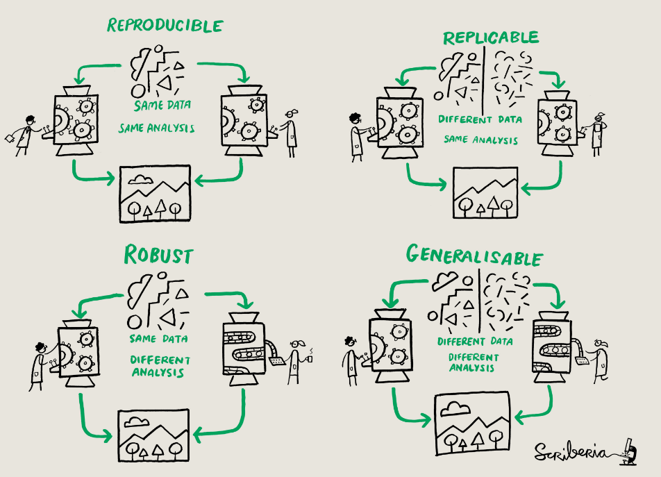

[TOC]

<script type="text/javascript" src="http://cdn.mathjax.org/mathjax/latest/MathJax.js?config=TeX-AMS-MML_HTMLorMML"></script>
<script type="text/x-mathjax-config">
    MathJax.Hub.Config({ tex2jax: {inlineMath: [['$', '$']]}, messageStyle: "none" });
</script>

# Markdown
## Headings and list

Checkbox

- [x] A
- [ ] D
- [ ] B
- [ ] C

## Font

1. *italic*
2. **bold**
3. ***italic&bold*** 
4. ~~strikethrough~~
5. ~~***italic&bold&strikethrough***~~
6. <u>underline</u>
7. <mark>mark</mark>；
8. <font color=red>red font</font>

9.  <font color=gray size=6>text</font>
10. 
this is about `hightligt code`, it woudl not run
```
this is about hightlight code in a block
```


## Link&picture

1. url:
[csdn](https://www.csdn.net/)

2. picture：



<br>


1. Local Documents

- [sheet](E:/academic_resources/Tutorials/data/twitter_cit_data.csv)
  
- [pdf](E:/academic_resources/202110_AFFC-X-Traning/AFEC-X_2021_schedule.pdf)
  

## Formula

1. In a sentence ：

this is a $y_i=\beta_0+\beta_1X_i+\varepsilon_i$  formula

2. In a paragraph ：

this is also a formula 
$$y_i=\beta_0+\beta_1X_i+\varepsilon_i$$ 

## content

1. 
```diff
+content added
-content deleted
```
2. cite

> cite 1.1
>> cite 1.1.2

3. hide

- way1

<details>
<summary>Open it</summary>
<pre><code>
surperise!
</code></pre>
</details>

- way2

<details>
<summary>Open it</summary>
surperise!
</details>

- way3

<details>
surperise!
</details>


## sheet

|name|sex|age|nationality|
|--:|:--:|--|:--|
|Kate Williams|F|23|CHN|
|Jay|Male|18|UAS|
|Tom|Male|5|HK|

